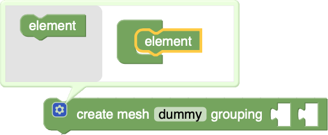
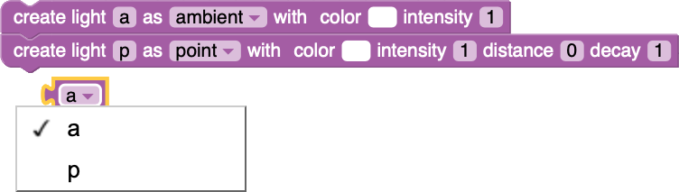

# B3JS 

**B3JS** is a project, whose purpose is that of combining two JavaScript realities, such as **Blockly** and **Three.js**, into a single Web Application.

It links each Blockly block to a portion of JavaScript code belonging to the 3D library, in such a way that the user doesn't need to know a programming language in order to produce and/or consume a 3D content.

## Installation
In order to use the application:

* Download it from this repository and place it on your machine.
* Open a terminal window inside the *B3JS/* folder.
* Launch the following command: ``php -S localhost:8000``
* Open Google Chrome or Firefox and go to the address <http://localhost:8000/index.html>.

Otherwise place it on a server fully supporting PHP.

## Blocks
The designed blocks are introduced in the following sections. Presenting them in block-ID order seems to be an optimal choice, because it provides a common thread among their shared features. The ID itself is informative about the block, in fact its naming convention imposes the concatenation between the constant ``b3js``, a *Label*, a *Type* and, only for certain ones, additional strings.

### Label ``create``
Blocks, whose block-ID starts with ``b3js_create``, are statements blocks. Their shape is visible in the following figure and they are intended to create a specific Three.js element. The *Type* attribute is used to clarify at **blockly level**, what kind of block we are going to create. We have seven blocks overall but only five types.

When we drag one of them into the workspace, a prompt message appears for associating a name to the block itself, which is then stored into an internal structure.
*Type* can assume the five values ``Camera``, ``Light``, ``Geometry``, ``Material`` and ``Mesh``, depending on the block we are using.
Each parameter is conveniently bounded to a comfortable (in terms of efficiency and practicality) range, so that the client is not tempted to overdo values.
Now lets focus on each ``b3js_create`` block singularly, trying to explain its usage.

#### b3js\_create\_camera
This block is used to instantiate cameras.

The drop-down field changes the *Subtype* of the future variable, with available options ``perspective`` and ``orthographic``. Then we have the parameters to pass to the constructor. They change according to the drop-down selection:

* ``fov``: the field of view is the vertical angle, computed from the viewing direction up.
* ``near``: the near plane of the camera, precisely the point from which we start seeing.
* ``far``: the far plane is the opposite of the near one, the end of the viewing volume.
* ``scale``: this is an artificial parameter introduced in order to compress top, bottom, left and right parameters into a single one. Specifically it sets the viewing volume (which is a cube) with components derived from the canvas' width and height, scaled by its factor.

This last parameter replaces ``fov`` when ``orthographic`` is checked in the drop-down and it has nothing in common with the scaling factor of the camera.

#### b3js\_create\_light
The block for creating light is shown below.

Three.js supports different kinds of lights, in fact we can instantiate (as ``Subtype``):

* ``ambient`` light: the basic light, simply adding its value to the global illumination.
* ``point`` light: a point in the space radiating intensity in all directions.
* ``spot`` light: a point in space projecting a light cone.
* ``directional`` light: similar to spot light but so far away that the rays revert to parallel lines.
* ``hemisphere`` light: a particular type of light simulating the open space environment.

The parameters are again fully responsive, changing the offer based upon the value of the drop-down. They include ``color``, ``intensity``, ``decay``, ``groundColor`` and so on. The reader can become acquainted with their meanings by reading the documentation of the library.

#### b3js\_create\_geometry
Only a selected subset of geometries can be represented in B3JS at the moment and the block responsible for their creation is the following.

Geometries are easier to work with than BufferGeometries as they store attributes such as vertices, faces, colors and so on directly (rather than in buffers). For this reason, even if they are generally slower, the representable shapes belong to this very group and among them we can choose as ``Subtype``:

* ``plane``: a simple two dimensional plane.
* ``box``: a box with ``width``, ``height`` and ``depth``.
* ``sphere``: a sphere with ``radius``.
* ``cylinder``: a cylinder with top and bottom ``radii`` and ``height``.
* ``torus``: a torus with ``radius`` and ``tube`` size.

Their level of detail (how many faces are part of the topology) can be tuned using the parameter ``detail``.

#### b3js\_create\_material
The same concept of choice stands for materials: their create block can instantiate only materials in the subset of MeshMaterials.

Their kind here can be:

* ``basicMat``: The simplest material, which is not affected by lights and instead applies a flat color to geometries.
* ``depthMat``: A material for drawing geometry by depth. Depth is based off of the camera near and far plane. White is nearest, black is farthest.
* ``normalMat``: A material that maps the normal vectors to RGB colors.
* ``lambertMat``: A material for non-shiny surfaces, without specular highlights.
* ``phongMat``: A material for shiny surfaces with specular highlights.

The parameters vary according to the choice, but with material blocks the array of option is limited to ``color`` for ``basicMat``, ``lambertMat`` and ``phongMat`` and to ``wireframe`` for ``depthMat`` and ``normalMat``.

#### b3js\_create\_mesh
The block creates a simple Mesh in Three.js. It is different from the previous ones because it takes in input two values: a geometry and a material.

Keeping in mind that the *Type* refers only to Blockly, while the *Subtype* helps both the libraries in understanding the concrete handled object, here we don't have any drop-down options, so we just create an object of type mesh and subtype ``mesh``. Meshes are the characters of our scenes and sometimes it is not sufficient to work only with a limited range of geometries. For this reason we have two additional create blocks for importing models from outside or for creating complex groups of simpler meshes.

#### b3js\_create\_mesh\_from\_file
The block in question accepts as parameter a string, that is the name of one 3D model, dwelling in the *resources* folder. The accepted formats are *.obj* for OBJ models, *.dae* for Collada models or *.gltf* and *.glb* for GLTF models.

The creation process is a **Promisifying** loading routine, activated by the run button. What it does is to import the model before execution, making the subsequent rendering visually safe. The method expects all companion files to be placed in the same folder as before, without nesting.
The *Type* of this block is again mesh while the *Subtype* is the artificial tag ``imported``. This artifact is necessary because it is not possible to say a priori how the model had been organized: it could be a simple mesh, a group or an entire scene and it could have bones and animations. Fortunately all these types extend the same superclass **Object3D** and share the same functions, so dealing with them is relatively transparent to the user.
The models are imported into a buffer, named *usr_res*, which is indexed by object name and from there they are referenced or cloned.

#### b3js\_create\_mesh\_group
The last create block is used to build complex meshes, starting from simpler ones. You will see a gear which is the distinctive mark of a **Blockly Mutator**.

By pressing the gear, an interactive panel will appear, allowing to stack elements as newly added inputs for the block. Therefore it accepts a mutable number of elements and all of them should be of type mesh.

The meshes are added to the group as **clones** of the object, so that changes in any object don't affect the children as well. The *Type* of this block is mesh and the *Subtype* is ``group``.
There are restriction on the cloning process, for which the inputs can be only filled with simple meshes, imported meshes or simple groups, but not with groups made also of imported meshes. The success of the process also depends on how the model is structured: for badly formed resources the animations could be misunderstood, leading to incorrect movements.

### Label ``value``
Blocks, whose block-ID starts with ``b3js_value``, are value blocks, meaning that they are meant to return some value. Their purpose is that of retrieving an instantiated ``b3js`` element. At Blockly level they respect the creation *Type*, so they can be plugged into other blocks accordingly. Their *Subtype* instead inherently depends on the drop-down of the create block itself.

At the beginning, if no ``b3js_create`` block is used, the corresponding ``b3js_value`` blocks are deactivated and unusable. On the contrary when instances are present, the blocks look like above. They are made of a single drop-down, showing the names of the elements, carefully separated by *Type*. This is mainly done for giving assistance to the client, who is supposed to be a beginner. The next figure visualizes the drop-down in action, where we have two separate instances of Light.

B3JS value blocks are so important because they represent the **subject** of almost any action involving the custom blocks. For this reason they are very frequent and their context change is tuned in such a way that the workspace always remains consistent. As an example:

* when a create block is deleted, all value blocks, with the same name and type, are deleted too.
* when a create block is subject to a drop-down change, all value blocks, with the same name and type, are adjusted too.

### Label ``set``
The Label ``set`` is peculiar of six statement blocks. As the name suggest they are responsible for the setup of a particular attribute in the given element.

Each ``b3js_set`` block, apart from ``b3js_set_scene``, has a **left input** and a **right input**. The first represents the subject of the setup, and so the element whose field will be changed, while the second is the new value for that element. The category ``b3js_set`` is also dynamic and the drop-down options depend on the *Subtype* of the block fed into the left input.

As an example in the preceding figure, the material b, which is a ``basicMaterial``, only have a smaller array of options with respect to the material p, which is a more complex ``phongMaterial``. The discussion proceeds with a quick explanation, block by block, of the expected types to be given in the left and right inputs. Keep in mind that as an alternative you can always provide a Variable (its type is Any!), to any of the inputs in question; in this case the variable should contain a proper object or an error will be issued.

#### b3js\_set\_scene
You may have noticed this block because it is lacking the left input. B3JS in fact is a single scene environment, so it only has one instance of the scene and consequently the subject is already declared in the block.

The allowed option/right inputs pairs are listed below:

* ``background``: it can receive either Color, String (containing an \#HEX value) or Texture.
* ``fog``: it accepts Fog, adding that effect to the scene.
* ``autoUpdate``: it receives Boolean. If true, it checks every frame if the scene and its objects needs matrix updates.
* ``overrideMaterial``: it override the material of its children with the Material fed.

#### b3js\_set\_camera
The block setting attributes for the camera is the one depicted in the next figure.

The block accept as a left input a Camera, which of course can be ``perspective`` or ``orthographic`` and it has as drop-down cases the following:

* ``position`` and ``lookAt``: they expect a vector of 3 components, whose type is Vec3 in B3JS. The first set the position of the camera, the second the position it has to point to.
* ``translation`` and ``scale``: they need again Vec3 for setting the point we want to translate the camera to or the components of the scaling factor.
* ``rotateX``, ``rotateY`` and ``rotateZ``: they take Number. They rotate the camera around the selected axis by the given value.

#### b3js\_set\_light
This block has a wide variety of select-ables, in fact light is one of the most important elements in the world. The left input should match the type Light.

The right inputs instead should be of the following kinds:

* ``color`` and ``groundColor``: they accept Color or String (like before). The attribute ``groundColor`` is only present when you're dealing with ``hemispereLights``. In that case it is associated to the color of the ground, while ``color`` refers to the color of the sky.
* ``intensity``, ``decay``, ``distance``, ``penumbra`` and ``angle``: they all accept Number. They specify various attributes of the light, like its strength, the dims along the distance and attenuation.
* ``position``: this is again a Vec3, representing its position in space.
* ``target``: it allows ``spotLights`` to face a distinct object, so its type should correspond to Mesh.
* ``visible`` and ``castShadow``: they accept Boolean. They set a specific behavior of the light. In particular, at Blockly level, ``castShadow = true`` triggers a mechanism into the renderer for projecting shadows.

#### b3js\_set\_geometry
The block for setting geometries is the flattest among the others, just because it doesn't change with respect to the *Subtype* of its left input. This latter should in any case match the type Geometry.

The options only concerns the movement and they expect as right input Vec3 or Number. The Three.js API suggests to modify geometries' positioning only sporadically and outside of any loop. You could use this block for adjusting the initial orientation of an object, but for animation, you should create a mesh from the geometry and move it instead.

#### b3js\_set\_material
Materials have a lot of options too. This is due to the fact that they are responsible for the appearance of every object in the scene. For setting a particular attribute you should plug a block, whose type is Material, in its left input.

The right inputs instead accept:

* ``color``, ``emissive`` and ``specular``: Color or String (as above). The emissive color is solid and unaffected by other lighting, while the specular one is the color of the reflection.
* ``map``, ``bumpMap`` and ``normalMap``: they receive Texture. The ``map`` is the basic material texture, ``bumpMap`` and ``normalMap`` are used to give the impression of displacement in the output.
* ``transparent``, ``visible``, ``depthTest`` and ``wireframe``: they are Boolean setting the characteristics of the material.
* ``opacity`` and ``shininess``: they need Number. The ``opacity`` has only effect if ``transparent`` is set to true, while ``shininess`` is the strength of the specular reflection.

#### b3js\_set\_mesh
The last ``set`` block looks upon meshes. Visually it appears like in the following figure and as left input it takes Mesh.

Here the available options are:

* ``geometry``: it takes a Geometry and overrides the mesh's geometry with the one provided.
* ``material``: it does the same thing but with Material.
* ``mesh``: it is not used in ``b3js_set_mesh`` but only in its ``getfrom`` counterpart.

* ``child``: it accepts Mesh type (of any *Subtype*). This option changes completely the aspect of the block and it is used to add meshes to the current group.
* ``children``: it has no right input. It is used to clear the children list of the left input group.
* ``position`` and ``lookAt``: they want Vec3 as always. In the ``position`` case it gives the possibility to specify also the component, thus if you select ``xyz`` from the further drop-down, the right input should be Vec3, otherwise if you select a single component ``x``, ``y`` or ``z``, the input should be Number.

### Label ``update``
The block, whose block-Id starts with ``b3js_update``, is a statement block. There is no other one with this *Label* and its *Type* is Mesh. The block is used as an enforcement to command the movement of meshes.

The first drop-down let the user choose the operation (among ``translate``, ``rotate`` and ``scale``) to perform on the plugged mesh. The second drop-down instead chooses the component of the transformation. For a single component the right input takes Number, while for ``xyz`` it takes Vec3.

The option ``along`` lets the block achieve a further shape, with an additional right input: the first is the Vec3 of the direction and the second is a Number, the amount of which, will be the factor of the transformation along the direction.

### Label ``getfrom``
The label ``getfrom`` is typical of those value blocks retrieving the selected attribute of an object. They share the same mechanics and lists as the ``b3js_set`` blocks and there is one of them for each *Type*, for a total of five.

They take as argument only the subject of the action, so the right input is not necessary.
For all of them, the returned object depends on the drop-down field and even in this case the *Type* mesh has some exceptions.

When we deal with groups and we want to retrieve one particular object, we need to specify its index, therefore the newly appeared right value should be a Number. The difference between retrieving a ``mesh`` or a ``child`` in a group is that, in the first case the search considers recursively only ``Mesh`` and ``SkinnedMesh``, in the second case instead only its direct children.

### Miscellaneous
There are other custom blocks, which doesn't belong to any of the labels considered in precedence. They were designed either to improve the quality of the connection between blocks, making them useful to forbid repetition, or to supply a compelling way of building the scene and rendering animations.
We will analyze how to work with them and their effect on the canvas.

#### b3js\_render\_loop
The block in question is the most important and insidious one.

From its look you can tell that we are treating a statement block (it has top and bottom connections), but in addition it also has a middle connection for stacking further statement blocks. Therefore it is a **loop statement block** realizing the render loop.
At the beginning it is disabled from the toolbox because in order to even exist it needs a ``b3js_create_camera`` block to be dragged into the workspace. If you do so, you can instantiate a **single** ``b3js_render_loop`` block for rendering the scene, single because B3JS is a mono renderer application, thus you cannot switch between multiple shading programs.
The block takes in input a Camera and any number of statement blocks, whose actions will be **repeated for each frame**, generated by the JavaScript function *requestAnimationFrame()*.
The numeric field called ``fps`` is a parameter adjusting the frame per second, thought for cases where we need to slow down the animation.

#### b3js\_upon\_event
The block discussed here is a function block with a drop-down and a predefined argument.

The drop-down let the block switch from ``click`` to ``keyDown``. When the first is selected the block adds an **on click** listener function to the canvas element, whose argument, called ``targetMesh``, references the clicked **mesh**.
When the second is selected instead, the block adds an **on key down** listener function to the whole document, with argument the numeric code of the pressed key.
In both cases the blocks stacked into the middle connection constitute the body of those functions and the argument, either ``targetMesh`` or ``keyDown``, can be found in the Variables panel.

#### b3js\_play\_animation
This block is a statement block intended to allow to imported meshes to play their built in animations. The loading of finely sculpted 3D models, paired with detailed movements, is actually a standard.

The first input is a mesh and the second one is a Number. The mesh cannot be simple or group and in order to have effect, it mush own at least one animation; the number instead decides which animation will be played.

#### b3js\_add\_scene
The statement block presents a Blockly mutator similar to the one we have already seen.

The numerous inputs, you can add to the block, can receive types Camera, Light or Mesh. Based upon the conditions you can plug in all these elements at once (if you know already what you want to add to the scene) or programmatically using a loop. The block is extremely important because if the user forget to provide an element, it will not be drawn to the canvas. As a rule of thumb use this block outside the ``b3js_render_loop`` block.

#### b3js\_vector blocks
The value blocks described in here generate three different types: Vec2, Vec3 and Vec4.

Basically they abbreviate the machinery behind the composition of blocks by providing an already defined type, made of several components. Vec3 is the most used when working with positions and transformations. The other two were designed rather with the intent of expanding the functionalities of B3JS in the future, because at the moment they have no impact on the application.

#### b3js\_image\_texture
This value block is placed in the Material category but its actual returned type is Texture.

The required input here is the name of an image, either in PNG or JPG format, which should be stored in the previously cited folder *resources/*. The other visible drop-drowns supply the client with the choice for the wrapping and filtering techniques. In particular the wrapping will be equal for the *s* and the *t* components and the filter will be the same for minification and magnification.
The block should be used in accordance with the mapping attribute of materials or as a background for the scene.

#### b3js\_linear\_Fog
The last block in this review is the value block for generating the Fog effect. Unsurprisingly it is also found in the Material category and it generates an element of type Fog.

The effect is indeed very simple to achieve: it takes three parameters, a ``color`` and two distances called ``near`` and ``far``. These last define the two planes that rule over visibility: the scene is normal until the near plane, between near and far planes it is color-blurred and after the far plane only the color is visible.
